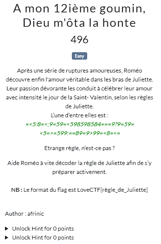
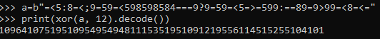

A ciphertext was given to us. It's : "=<5:8=<;9=59=<598598584===9?9=59=<5=>=599:==89=9>99=<8=<=".

Using online tools doesn't help me going further.

Looking the description and paying attention to the whole challenge, we found a suspicious number "12".

While xoring it with the given ciphertext, we got an interesting sequence of number : 109641075195109549549481115351951091219556114515255104101.

That number, after many trials and errors, seems to be ascii value, but space are removed.

Let's take a closer look that : 109 is "m", 64 is "@" and so on... 

The charset given as hint was supposed to help us reduce the scope of ascii characters to test because 10 is also an ascii value...

The whole script is available in [solve.py](files/solve.py).

Executing it displays "m@k3_m6_10o53_my_8r347he" on the screen, which is though Juliette's rule.

So the flag is : LoveCTF{m@k3_m6_10o53_my_8r347he}.