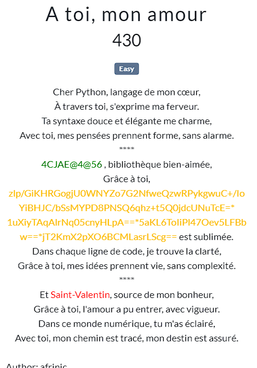

The context tells us about a love story but also about a cipher mechanism.
We know that a python library has been used with the key "Saint-Valentin" to cipher a message.
Also we have the cipher result.

============================================================================================
library = "4CJAE@4@56"

chiffre = "zlp/GiKHRGogjU0WNYZo7G2NfweQzwRPykgwuC+/IoYiBHJC/bSsMYPD8PNSQ6qhz+t5Q0jdcUNuTcE=* 1uXiyTAqAlrNq05cnyHLpA==*5aKL6ToIiPl47Oev5LFBbw==*jT2KmX2pXO6BCMLasrLScg=="

cle = "Saint-Valentin"
============================================================================================

The challenge here is to find the library name because a ciphered one has been given.
Going to dcode.fr, we identify potentially 3 ciphers.
Only rot47 output a human-readable string after deciphering.*
what_possible_cipher.png
correct_cipher_found.png

So, the library name is "cryptocode".
We then search over internet what it is and how it can be used to cipher and deciphering message.
We come across the documentation here 👉 https://pypi.org/project/cryptocode/.

The folloowing lines will describe the exploit :
- first : install "cryptocode" by running 👉 'pip install cryptocode' 👈 in a terminal
- write a python code to decipher the understandable message (solve.py)

Running "solve.py" outputs the flag : LoveCTF{pyth0n_1f_y0U_w3r3_n07_a_l@n9ua93_i_wi1l_m4rrY_yoU}