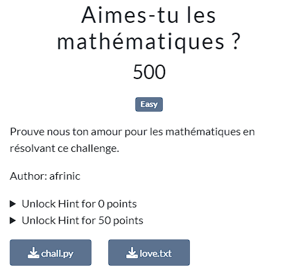
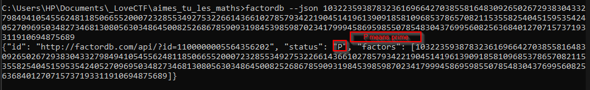

The challenge is about mathematics, so let's think Mathematics.

Reading chall.py, it was easy to recover x. In fact, the condition "int(binaire) & 1" leaks information about x's bits when it comes to its binary representation. And thus, ❤️ is equivalent to 1 and 😘 to 0. Also "x >>= 1" deletes the last bit of x's binary representation each time from end to beginning. And because of that, we have to reverse our the process while recovering x's bits.
All of this can be done with this simple line of code : 'x = int(open("love.txt", "rb").read().decode().replace("❤️", "1").replace("😘", "0")[::-1], 2)'

Now that we have x, we should find u.
Most of you think about RSA and perform a simple modular inversion, but it won't works.
First of all, u is a prime number.

When you approach the second challenge like a rsa prime modulus one, and suppose e to be 64, you'll get a "not invertible base" error when figuring out d (d = pow(64, -1, u-1)). And here, the use of 'root unity modulo u' won't help you at all.

You have a prime number and 64 is a power of 2 (64 = 2**6). What math concept do you think about ?
This should normally leads you to think about "quadratic residue" and "Legender symbol" in Theory number course.

By applying quadratic residue formula to pow(bytes_to_long(message.encode()), 64, u), you'll get possible values for pow(bytes_to_long(message.encode()), 32, u) and by going down you'll get possible values for pow(bytes_to_long(message.encode()), 16, u) till possibiles values of pow(bytes_to_long(message.encode()), 1, u), and finally the flag. Also, here u mod 4 gives 1, which means you need to use "Tonelli Shanks algorithm" so as to compute the quadratic residue at each layer.

To symplify the process, I just use a python module for computation and use a brute-force approach so as to find possibiles values of pow(bytes_to_long(message.encode()).
Go and check the script here : [solution](files/solve.py)

After running the script, we get that message : "Pour de vrai, vous aimez les mathématiques. Voici votre récompense : LoveCTF{k15s_m@7hs_0n_V4l3n71n6_da@4Ys_02035789_abcd}"

So, the flag is : LoveCTF{k15s_m@7hs_0n_V4l3n71n6_da@4Ys_02035789_abcd}