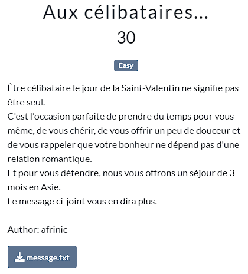
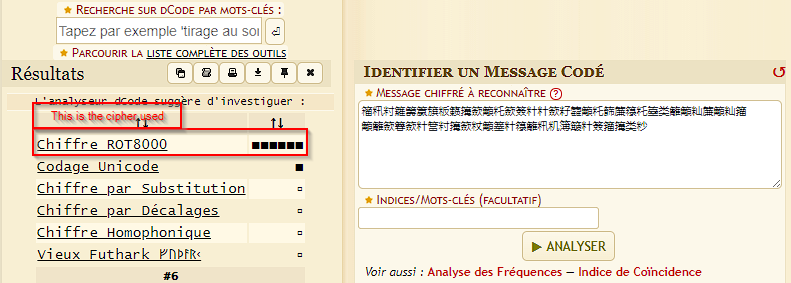
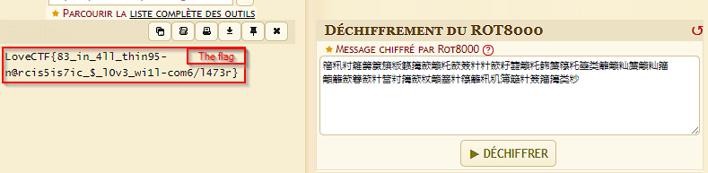

Going to https://www.dcode.fr/ leads you to know the cipher used. It's ROT80000.

Once you know that, you can know decipher the message and get the flag.

Thus, the flag was : LoveCTF{83_in_4ll_thin95-n@rcis5is7ic_$_l0v3_wi1l-com6/l473r}