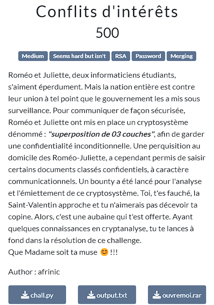
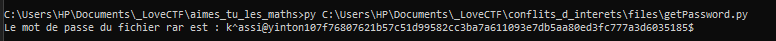
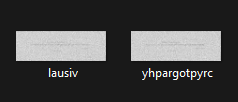
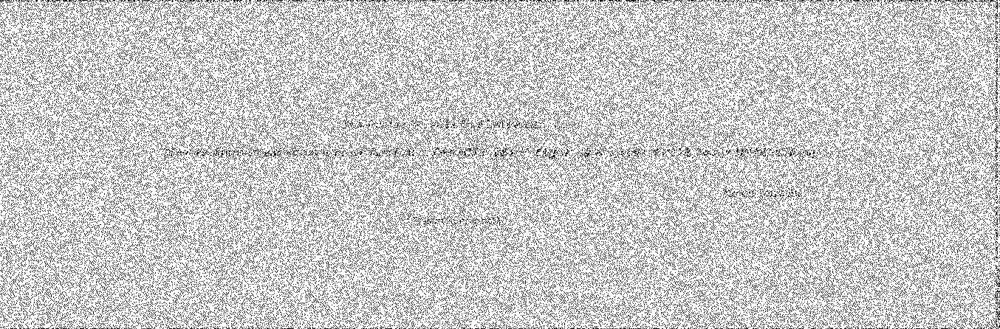
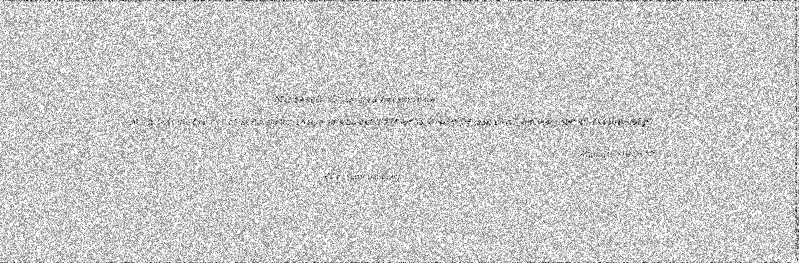
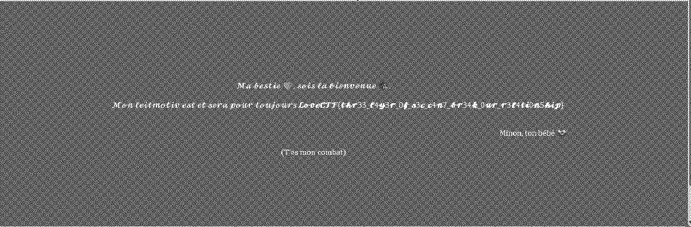

[chall.py](files/chall.py) and [output.txt](files/output.txt) are supposed to be exploited so as to retrieve the rar password.
Greater details can be found here : [getPassword.py](files/getPassword.py) 

Executing the exploit give us "k^assi@yinton107f76807621b57c51d99582cc3ba7a611093e7db5aa80ed3fc777a3d6035185$" as password.

We use it to extract the rar archive. And we got two files.

Those filenames ( and ) tells us about visual cryptography which is a method of encryption. After some research on internet, we understood the process of visual cryptography and wrote a python script for better symplicity. Check it here 👉 [mergeFiles.py](files/mergeFiles.py).

As soon as we ran it, a file has been prompted and it contains the flag.

So, the flag is : LoveCTF{thr33_l4y3r_0f_s3c_c4n7_br34k_0ur_r3l4ti0n5hip}