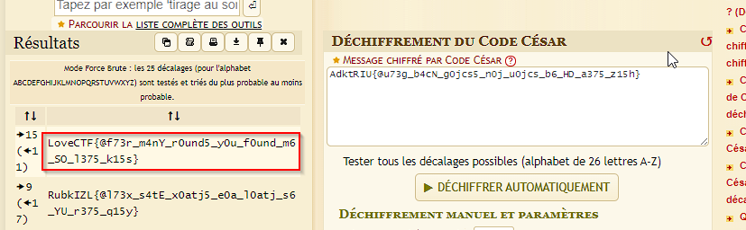

This was a very basic crypto chall. Multi layers of encryption have just been applied.

The steps you must be going on till the flag are :
- chall.txt content : "RlVYQzRMUk9GWVdTNENSTkZZWEMyTFJORlVXUVVMSk5GWVhDMkxSTkZZRkMyTEpPRllXUzJMSk9CSVdTNExST0ZZV1M0TElLRlVYQzJMUk9GWVhDNENSTkZVWEM0TEpPRlVYQVVMSk5GWVhDMkxST0ZZRkMyTEpPRllXUzJMUk9CSVdTNExSTkZVV1MyTFFLRlVYQzJMUk9GWVhDNENSTkZZV1MyTEpPRlVXUVVMSk9GVVdTNExKTkZVRkMyTFJORllYQzRMUk9CSVdTMkxST0ZVWEM0TElLRlVYQzRMSk5GVVhDMkNSTkZZV1M0TFJPRllYQVVMSk9GWVhDMkxKT0ZZRkMyTFJPRlVXUzJMUk9CSVdTNExSTkZZV1M0TElLRlVXUzRMUk5GVVdTMkNSTkZZWEM0TEpPRlVYQVVMSk9GVVhDNExST0ZZRkMyTFJPRlVYQzJMUk5CSVdTMkxST0ZVV1MyTElLRlVYQzRMSk9GWVhDMkNSTkZZV1M0TFJPRllYQVVMSk5GWVhDMkxSTkZZRkMyTFJPRllXUzJMUk9CSVdTNExSTkZVV1M0TFFLRlVYQzRMSk9GVVhDMkNSTkZVWEM0TEpORlVXUVVMSk9GWVdTMkxST0ZZRkMyTFJORllYQzRMUk9CSVdTNExKTkZZWEM0TElLRlVYQzRMSk5GVVhDNENSTkZVWEM0TEpPRlVXUVVMSk9GWVdTMkxKT0ZVRkMyTFJORllYQzRMUk9CSVdTNExSTkZVWEM0TFFLRlVXUzRMUk5GVVhDNENSTkZVWEM0TEpPRllYQVVMSk9GWVhDMkxSTkZZRkMyTFJORlVXUzJMSk5CSVdTNExST0ZZV1M0TFFLRlVYQzJMUk5GWVdTNENSTkZZV1MyTFJORlVYQVVMSk9GVVhDMkxKT0ZVRkMyTFJPRllXUzRMSk5CSVdTNExSTkZZV1M0TFFLRlVYQzRMSk5GWVdTMkNSTkZZV1MyTEpORlVYQT09PT0="

- decode chall.txt content from base64
"FUXC4LROFYWS4CRNFYXC2LRNFUWQULJNFYXC2LRNFYFC2LJOFYWS2LJOBIWS4LROFYWS4LIKFUXC2LROFYXC4CRNFUXC4LJOFUXAULJNFYXC2LROFYFC2LJOFYWS2LROBIWS4LRNFUWS2LQKFUXC2LROFYXC4CRNFYWS2LJOFUWQULJOFUWS4LJNFUFC2LRNFYXC4LROBIWS2LROFUXC4LIKFUXC4LJNFUXC2CRNFYWS4LROFYXAULJOFYXC2LJOFYFC2LROFUWS2LROBIWS4LRNFYWS4LIKFUWS4LRNFUWS2CRNFYXC4LJOFUXAULJOFUXC4LROFYFC2LROFUXC2LRNBIWS2LROFUWS2LIKFUXC4LJOFYXC2CRNFYWS4LROFYXAULJNFYXC2LRNFYFC2LROFYWS2LROBIWS4LRNFUWS4LQKFUXC4LJOFUXC2CRNFUXC4LJNFUWQULJOFYWS2LROFYFC2LRNFYXC4LROBIWS4LJNFYXC4LIKFUXC4LJNFUXC4CRNFUXC4LJOFUWQULJOFYWS2LJOFUFC2LRNFYXC4LROBIWS4LRNFUXC4LQKFUWS4LRNFUXC4CRNFUXC4LJOFYXAULJOFYXC2LRNFYFC2LRNFUWS2LJNBIWS4LROFYWS4LQKFUXC2LRNFYWS4CRNFYWS2LRNFUXAULJOFUXC2LJOFUFC2LROFYWS4LJNBIWS4LRNFYWS4LQKFUXC4LJNFYWS2CRNFYWS2LJNFUXA===="

- decode the previous output from base32
"-.....-.
-..-.---
--..-.-.
--..---.
-....-.-
-.-.....
--..-.-.
--..-...
--..--..
-..----.
-.-.....
-.---.--
-.--.---
-.-.....
--..-..-
-..---.-
-.-.....
-...--..
-..---..
-..-.-.-
--..----
-...-.-.
-.-.....
-..-.-.-
--..----
-..-...-
-.-.....
--..-.-.
-...--..
-..---..
-..-.-.-
--..----
-..--...
-.-.....
-.--...-
-..---..
--..-.--
-..---.-
-.-.....
-..--...
--..--..
--..-...
-...-.-.
-.------
-....-..
-.-.-.-.
-.--.--.
-.-.--.-
-...-.--
-..-.-..
-..--.--
-.-----."

- the third output seems to be morse code but isn't, it's binary. Here a code is needed to go from that scheme to ascii representation. You can consult it in [a_python_script](files/chall.py) 
Running the code will give you this string : "}h51z_573a_DH_6b_scj0u_j0n_5scj0g_Nc4b_g37u@{UIRtkdA"

- when reversing it looks like the flag but in some encrypted manner
AdktRIU{@u73g_b4cN_g0jcs5_n0j_u0jcs_b6_HD_a375_z15h}

- all you need now is to use a brute-force approach and recover the flag.
dcode.fr shows us 3 more probably encryption methods and we the one which worth it is "Caesar Cipher".

A simple brute force gives the flag.

And we got the flag : LoveCTF{@f73r_m4nY_r0und5_y0u_f0und_m6_SO_l375_k15s}