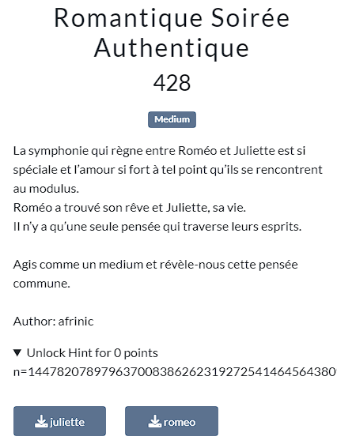

Here the common modulus attack on RSA was at stake.
Some clues are also given in the challenge such as "rencontrent au modulus", a common n value in the hint, different e in each file given...

Read more abouut it here 👉 https://infosecwriteups.com/rsa-attacks-common-modulus-7bdb34f331a5 👈

We then need to compute bezout coefficient for both e_romeo and e_juliette.
This site 👉 https://planetcalc.com/3299/ 👈 did the job very well.

All we need now is to abuse of that so as to discover the common idea on both Roméo and Juliette's mind.
Take a look at [solve.py](files/solve.py) to see the exploit.

Running the exploit outputs the flag : LoveCTF{h0n3y_hu9_ki5s_@nd_m4rry_m6}